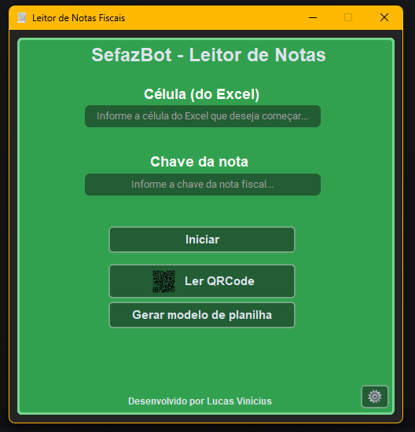

[🇧🇷 Português](README.md) | [🇺🇸 English](README.en.md)

# LeitorSEFAZ


Aplicação desktop desenvolvida em Python para consulta de notas fiscais através do portal da SEFAZ-PE. Os dados são coletados automaticamente e armazenados em uma planilha Excel.

## Índice

- [Sobre o Projeto](#sobre-o-projeto)
- [Funcionalidades](#funcionalidades)
- [Interface](#interface)
- [Dados Coletados](#dados-coletados)
- [Tecnologias Utilizadas](#tecnologias-utilizadas)
- [Download](#download)
- [Pré-requisitos](#pré-requisitos)
- [Instalação](#instalação-para-testes)
- [Executável](#executável-para-testes)
- [Como Utilizar](#como-utilizar)
- [Status](#status)
- [Autor](#autor)
- [Licença](#licença)

## Sobre o Projeto

O LeitorSEFAZ foi desenvolvido para automatizar o processo de consulta de notas fiscais eletrônicas no portal da SEFAZ-PE e registrar as informações em uma planilha Excel, reduzindo a necessidade de preenchimento manual.

## Funcionalidades

- Leitura de QR Code pela câmera.
- Inserção manual da chave de acesso ou via QR Code.
- Consulta automática de notas fiscais na SEFAZ-PE.
- Armazenamento automático dos dados em planilha Excel.
- Suporte a múltiplos navegadores: Firefox, Chrome e Edge.

## Interface



## Dados Coletados

- Data de emissão
- Estabelecimento
- Nome do produto
- Unidade de medida
- Quantidade comprada
- Valor unitário
- Quantidade
- Valor total

## Tecnologias Utilizadas

- Python
- OpenCV
- Selenium
- Xlwings
- Pillow
- Pyzbar
- CustomTkinter

## Download

Você pode baixar a versão mais recente do LeitorSEFAZ através da página de Releases do projeto.

[Download da versão mais recente](https://github.com/devlucaass/LeitorSEFAZ/releases)

## Pré-requisitos

- Python 3.10 ou superior
- Um dos navegadores suportados instalado: Mozilla Firefox, Google Chrome ou Microsoft Edge
- Microsoft Excel instalado no computador (para integração via Xlwings)

## Instalação

### Clone o repositório

```powershell
git clone https://github.com/devlucaass/LeitorSEFAZ.git

cd LeitorSEFAZ
```

### Crie o ambiente virtual

```powershell
python -m venv venv
```

### Ative o ambiente virtual (PowerShell)

```powershell
.\venv\Scripts\Activate.ps1
```

### Instale as dependências

```powershell
pip install -r requirements.txt
```

### Execute o projeto

```powershell
python src/main.py
```
## Executável

### Instale o PyInstaller

O LeitorSEFAZ também pode ser gerado como um executável para Windows utilizando o PyInstaller.

Com o ambiente virtual ativado, execute:

```powershell
pip install pyinstaller
````

O projeto possui um arquivo de configuração específico para o processo de build:

```text
LeitorSEFAZ.spec
```

Para gerar o executável, execute:

```powershell
pyinstaller LeitorSEFAZ.spec
```

Os arquivos gerados pelo PyInstaller serão armazenados nos diretórios `build/` e `dist/`.

O diretório `build/` contém arquivos temporários utilizados durante o processo de build, enquanto `dist/` contém o executável e seus arquivos necessários para execução.

## Como Utilizar

1. Abra o programa.

2. Gere uma planilha modelo no botão "Gerar modelo de planilha".

3. Salve a planilha modelo onde preferir.

4. Vá em configurações.

5. Clique em "Localizar planilha" e selecione ela.

6. Escolha o navegador que deseja utilizar (Firefox, Chrome ou Edge).

7. Salve as configurações e feche a janela.

8. Forneça a célula pela qual quer iniciar.

9. Escolha como informar a chave de acesso:

   - **QR Code**: clique em "Ler QR Code" e aponte a câmera para o código da nota (não requer resolver CAPTCHA).

   - **Manual**: digite a chave no campo e clique em "Iniciar" — será necessário resolver o CAPTCHA do site.

10. Aguarde a planilha abrir sozinha ou deixe a planilha modelo aberta.

## Status

✅ Funcional e em desenvolvimento ativo.

## Autor

Desenvolvido por **Lucas Vinícius**

- GitHub: [@devlucaass](https://github.com/devlucaass)

## Licença

Este projeto está licenciado sob a licença MIT. Consulte o arquivo [LICENSE](LICENSE) para mais detalhes.
